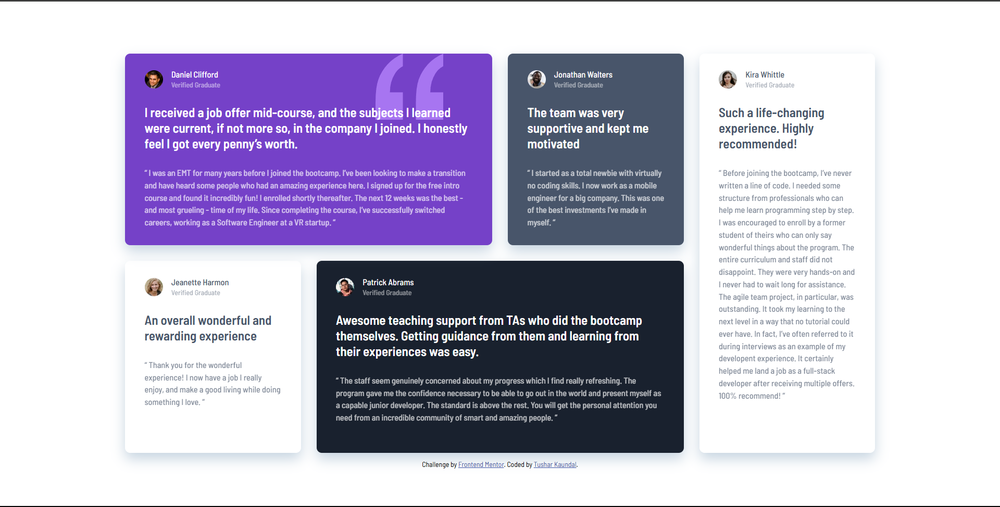

# Frontend Mentor - Testimonials grid section solution

## Welcome! 👋

Thanks for checking out this solution.

This is a solution to the [Testimonials grid section challenge on Frontend Mentor](https://www.frontendmentor.io/challenges/testimonials-grid-section-Nnw6J7Un7). Frontend Mentor challenges helped me improve my coding skills by building realistic projects.

## Table of contents

- [Overview](#overview)
  - [The challenge](#the-challenge)
  - [Screenshot](#screenshot)
  - [Links](#links)
- [My process](#my-process)
  - [Built with](#built-with)
  - [What I learned](#what-i-learned)
  - [Continued development](#continued-development)
  - [Useful resources](#useful-resources)
- [Author](#author)

## Overview

### The challenge

Users should be able to:

- View the optimal layout for the site depending on their device's screen size

### Screenshot

#### Desktop



#### Mobile


### Links

- Solution URL: [GitHub](https://github.com/TusharKaundal/Testimonials-Grid-Section-Main)
- Live Site URL: [Github Pages](https://tusharkaundal.github.io/Testimonials-Grid-Section-Main/)

## My process

### Built with

- Semantic HTML5 markup
- CSS custom properties
- CSS Grid
- Mobile-first workflow

### What I learned

Learned about how to use CSS grid in better way which helped me in creating good design.

Also Learned about SCSS and first-of-type and last-of-type CSS pseudo elements to get first and last child of the parent of a particular element(type).

```scss
.testimonials-cards__profile {
  display: grid;
  grid-template-columns: pxToRem(28px) 1fr;
  grid-template-rows: repeat(2, pxToRem(14px));
  grid-template-areas:
    "profile span-1"
    "profile span-2";
  column-gap: pxToRem(13px);
  span:first-of-type {
    @include fonts(500, 13px, 13px, 0px);
    grid-area: span-1;
  }
  span:last-of-type {
    @include fonts(500, 11px, 11px, 0px);
    opacity: 0.5;
    grid-area: span-2;
    align-self: end;
  }
  img {
    border-radius: 50%;
    object-fit: cover;
    grid-area: profile;
  }
  margin-bottom: pxToRem(24px);
}
```

### Continued development

For future project will try to implement grid-area property rather than grid-template for better design and responsive development.

### Useful resources

- [CSS Grid Guide](https://www.joshwcomeau.com/css/interactive-guide-to-grid/) - This helped me for learning about grid usage in web development for better designing. I really liked this pattern of explaining and will use it going forward.

## Author

- Website - [TusharKaundal](https://tusharkaundal.github.io/Testimonials-Grid-Section-Main/)
- Frontend Mentor - [@TusharKaundal](https://www.frontendmentor.io/profile/TusharKaundal)
